# Send Notification
Lille guide som viser hvordan man sender notification.

## Vælg [Send Notification]
Klik i menuen ude til venstre [Send Notification]
![Vælg [Send Notification]](../.gitbook/assets/steps-send_notification/step-0.png)

## Vælg en kendt bruger
I boksen til venstre er alle de kendte brugere i systemet, her vælger man dem der skal kaldes
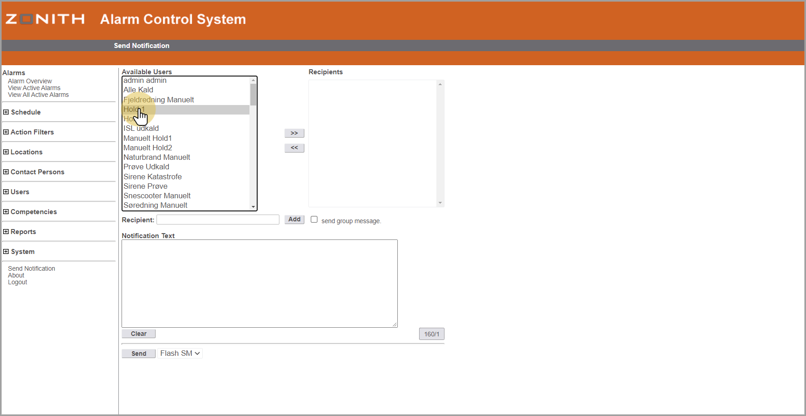

## Overfør den/de valgte
klik >> for at flytte den/de valgte brugere til den højre boks (Recipients = modtagere).
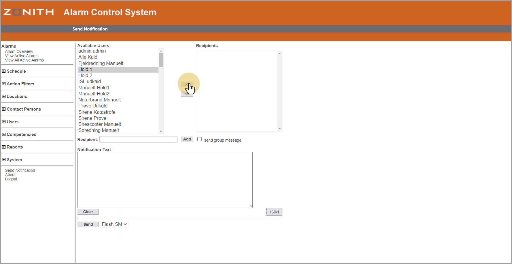

## Udfyld tekst
I vindue [Notification Text] skrives nu den tekst/besked man vil sende.
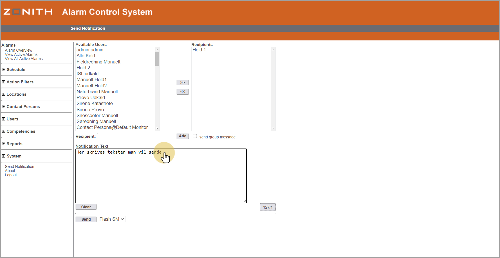

## Vælg medie
Vælg nu hvilket "medie" man vil sende på.

- Flash SMS
- Pager
- SMS
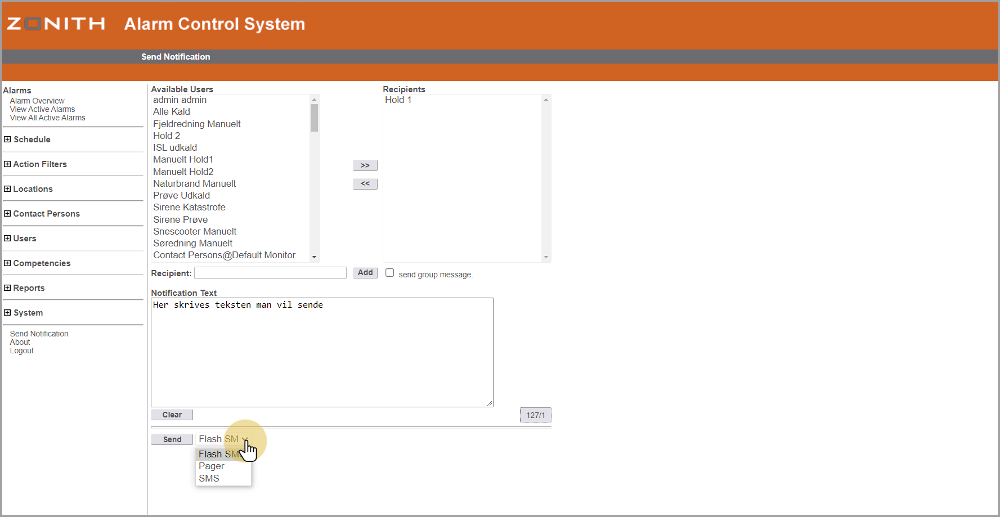

## Her vælger vi "Pager"
Vælg [Pager] for at kalde alarmmodtagere.
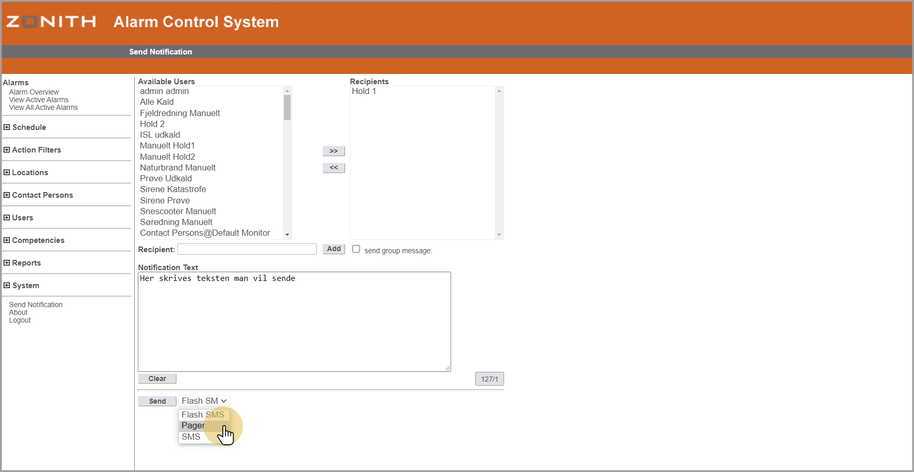

## Send besked [pager)
Tryk på knappen [Send] for at sende beskeden.
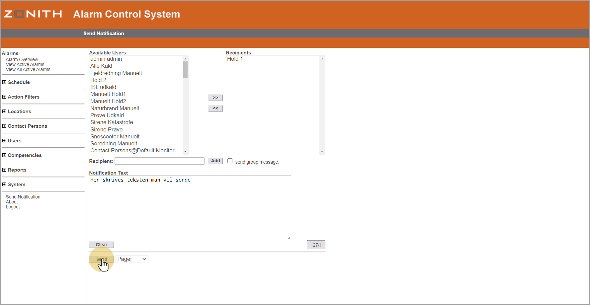

## Tjek udsending
Oppe i toppen vil der stå om beskeden blev sendt.
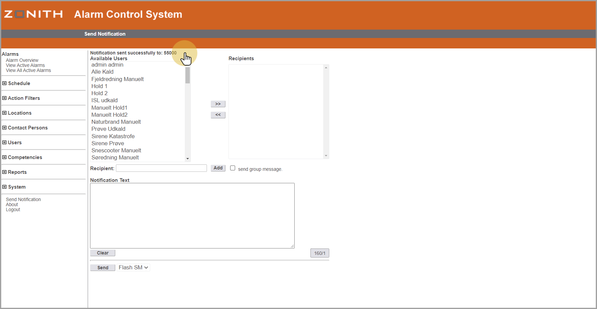

## Send besked [SMS)
Tryk på knappen [Send] for at sende beskeden.
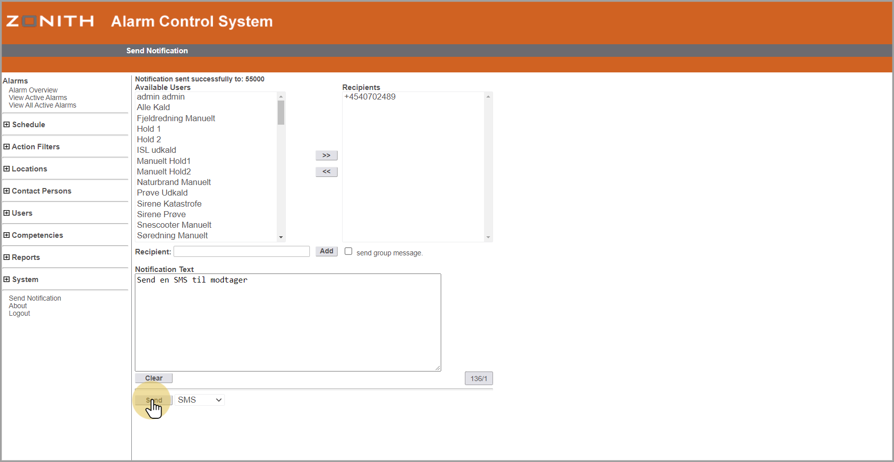

## Manuel modtager
I feltet "Recipient" udfyldes det nr. man vil sende til.

Dette kan være nr. til pager eller nr. til mobil.

Her vises eksempel med mobil.
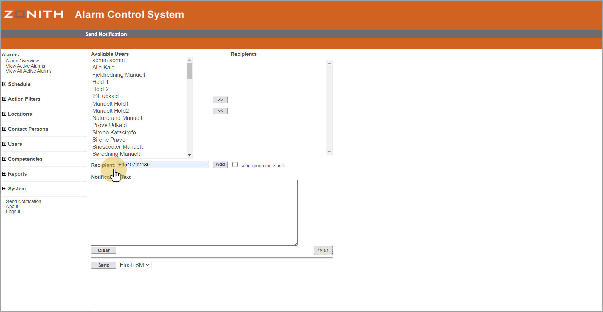

## Manuel - Tilføj modtager
Tryk knappen [Add] for at tilføj det manuelle nr.
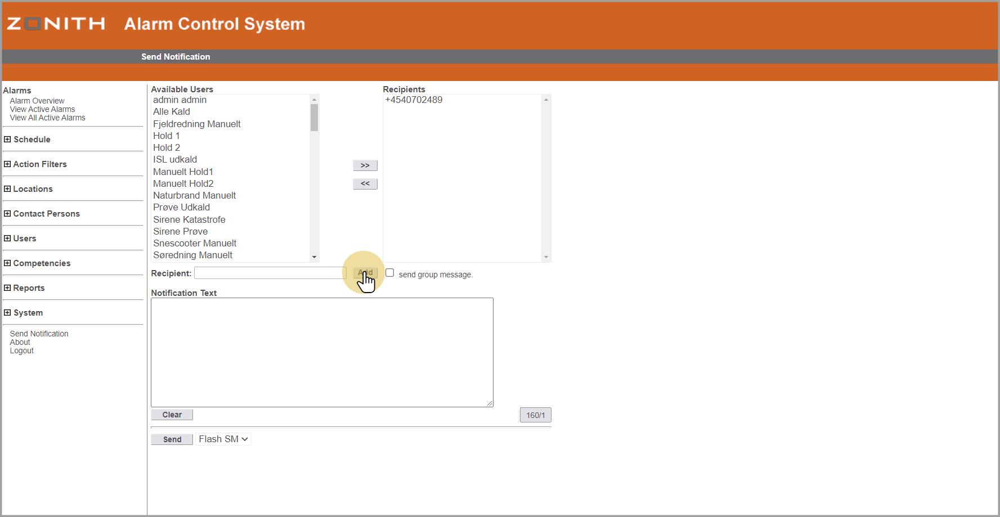

## Manuel - Udfyld tekst
I vindue [Notification Text] skrives nu den tekst/besked man vil sende.
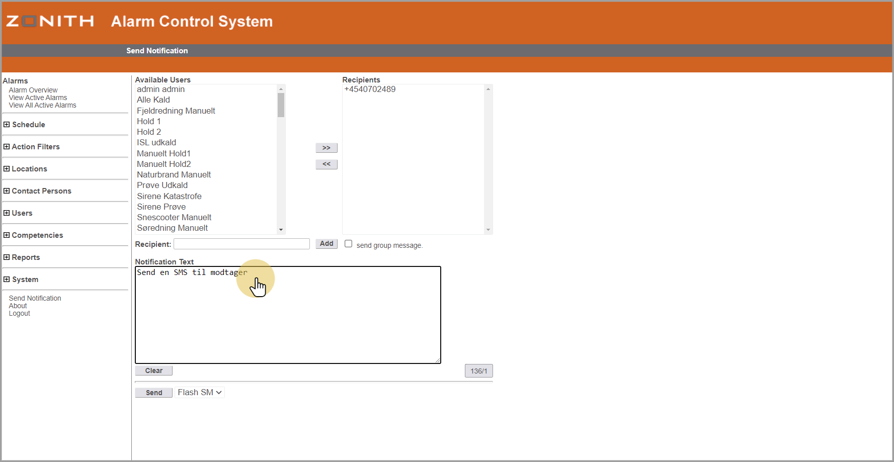

## Manuel - Vælg medie
Vælg nu hvilket "medie" man vil sende på.

- Flash SMS
- Pager
- SMS
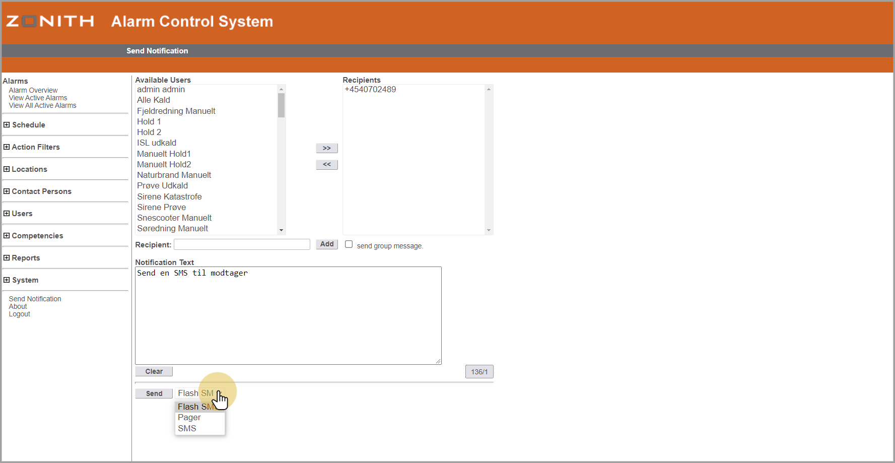

## Manuel - Her vælger vi "SMS"
Vælg [SMS] for at sende SMS til mobil.
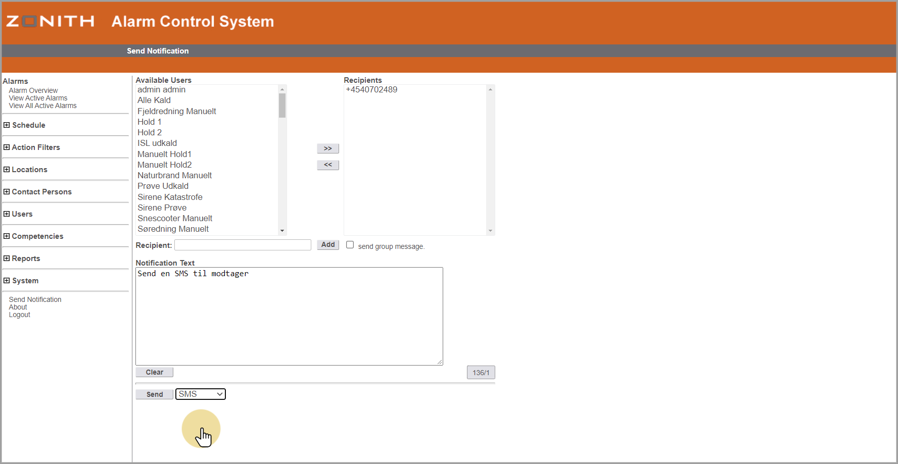

## Manuel - Send besked [SMS)
Tryk på knappen [Send] for at sende beskeden.
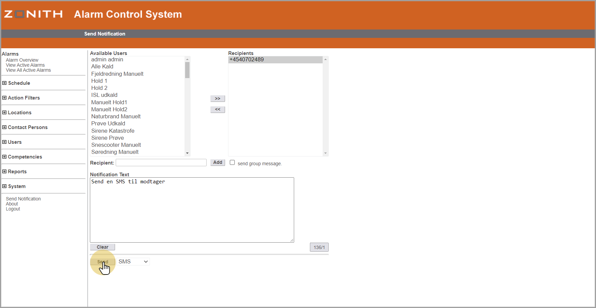

## EVT. Fejl
Hvis noget fejler vil det stå med RØDT i toppen.
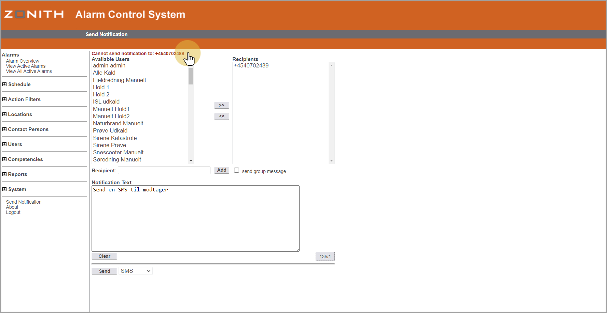

